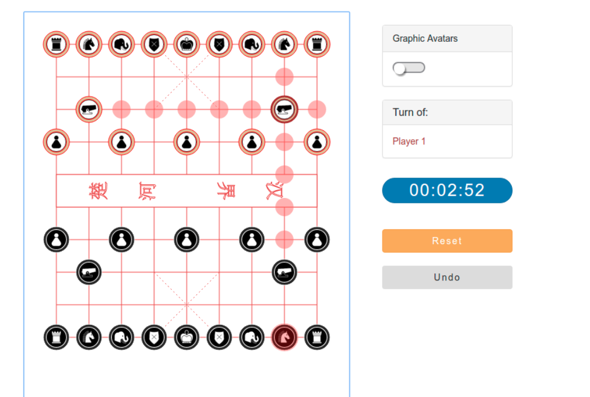

### Xiangqi

Xiangqi (Chinese Chess) is one of the most popular strategy board game in China. This project is built on  [ReactJS](https://facebook.github.io/react/) framework, plain Javascript for modeling, and rendering of the graphics is done with SVG nodes.

The application is assembled in [Webpack](https://webpack.github.io/), a web module bundler that runs on [NodeJS](https://nodejs.org/en/).

> npm install

> npm run start

